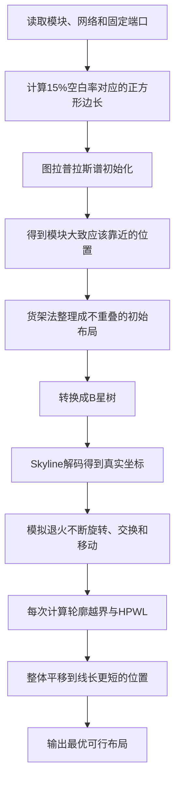
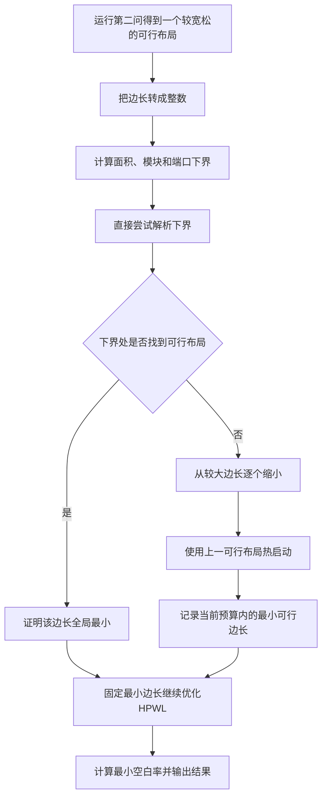

# 第二问与第三问算法流程通俗讲解

这份文档不追求复杂的公式推导，而是用比较直观的语言解释程序到底在做什么、为什么这样做，以及第二问和第三问之间是什么关系。

如果需要查看完整数学模型、复杂度和公式证明，可以再阅读同目录下的《第二问与第三问算法实现详解.md》。

---

## 1. 先用一句话理解整个算法

第二问的思路是：

> 先根据模块之间的连线关系，大致判断哪些模块应该靠近；再把它们整理成一个不重叠的合法布局；最后用模拟退火不断调整，得到固定正方形轮廓内线长较短的结果。

第三问的思路是：

> 先算出正方形边长不可能小于多少，再尝试把模块塞进这个最小边长；如果能成功，就证明已经达到最小空白率；最后在这个最小轮廓内继续优化线长。

---

## 2. 这个问题可以想象成什么

可以把整个 VLSI 布局问题想象成“在正方形房间里摆家具”。

- 每个模块是一件长方形家具；
- 家具可以旋转 90°；
- 家具之间不能重叠；
- 所有家具都必须放在房间内部；
- 模块之间的网络连接可以理解成电线；
- 固定端口是墙上不能移动的插座；
- 希望所有电线的总长度尽可能短。

第二问已经规定了房间面积，也就是空白率固定为 15%，任务是在这个房间中尽量缩短电线。

第三问则要求把房间继续缩小，寻找还能放下全部家具的最小正方形房间。

---

## 3. 第二问的整体流程



下面逐步解释每个环节。

---

## 4. 第一步：读取题目数据

程序需要读取三类数据。

### 4.1 模块数据

`.blocks` 文件告诉程序：

- 一共有多少个模块；
- 每个模块叫什么名字；
- 每个模块的宽和高是多少。

程序允许模块旋转 90°。例如一个尺寸为 `30 × 50` 的模块，旋转后就变成 `50 × 30`，但是面积不变。

对应代码：

```text
B_VLSI_Q1_v1/src/data.py
```

### 4.2 网络数据

`.nets` 文件告诉程序哪些模块或端口连接在同一条网络上。

例如：

```text
模块A -- 模块B -- 固定端口P1
```

表示 A、B 和 P1 属于同一条网络，它们如果离得太远，就会增加线长。

### 4.3 固定端口数据

`.pl` 文件给出固定端口的坐标。模块可以移动，但这些端口不能移动。

对应代码：

```text
B_VLSI_Q1_v1/src/netlist.py
```

---

## 5. 第二步：计算第二问的房间大小

先把所有模块面积相加：

$$
A=\text{所有模块面积之和}。
$$

题目要求空白率为 15%，所以正方形轮廓面积为：

$$
1.15A。
$$

正方形边长就是：

$$
S=\sqrt{1.15A}。
$$

举一个简单例子：如果模块总面积为 10000，那么房间面积就是 11500，正方形边长约为 107.24。

程序中的模块宽高和初始坐标是整数，所以在内部装填时使用边长的整数部分。例如理论边长是 454.34，实际整数装填容量就是 454。只要模块外包框不超过 454，就一定不会超出 454.34 的理论轮廓。

---

## 6. 第三步：先用图拉普拉斯判断“谁应该靠近谁”

如果一开始完全随机摆放模块，模拟退火需要花很长时间才能把关系密切的模块慢慢移动到一起。

因此程序先分析网表结构。

可以把每个模块看成一个人，把网络连接看成朋友关系：

- 两个模块连接越紧密，就越应该靠近；
- 一个模块如果连接某个固定端口，就应该适当靠近该端口；
- 网络连接较少的模块可以放得相对自由一些。

图拉普拉斯方法做的事情，就是根据这张“朋友关系图”，给每个模块计算一个大致的目标位置。

### 6.1 固定端口为什么要参与初始化

普通图拉普拉斯布局只知道模块之间是否连接，却不知道芯片上的固定端口在哪里。

本算法把固定端口当成“锚点”。例如某个模块与右上角的固定端口连接较多，那么它的初始目标位置就会受到右上角的吸引。

这样生成的初始布局不仅考虑模块之间的连接，也考虑模块与外部端口的连接。

### 6.2 为什么还要加入 Fiedler 方向

如果只让相连模块互相靠近，很多模块可能挤在同一个小区域中。

Fiedler 特征向量可以理解成一种“自然展开方向”：

- 强连接模块仍然比较接近；
- 整个模块群又会沿两个主要方向适当展开；
- 避免所有模块挤成一团。

因此最终的谱坐标由两部分组成：

```text
端口锚定产生的大致位置
        +
防止挤成一团的展开方向
```

对应代码：

```text
B_VLSI_Q1_v1/src/spectral_init.py
anchored_spectral_embedding()
```

### 6.3 谱坐标不是最终布局

图拉普拉斯得到的只是“希望模块大致在哪里”，它没有直接处理矩形重叠。

所以谱坐标中可能出现两个甚至多个模块叠在一起。这些坐标不能直接作为最终答案，只能用来指导后面的合法布局构造。

---

## 7. 第四步：用货架法把模块整理整齐

可以把正方形轮廓想象成一个书柜，把模块想象成大小不同的书。

程序先尽量把模块旋转成横向，也就是让较长的一边作为宽度、较短的一边作为高度。这样通常更容易一行一行地装入正方形。

然后按照模块高度从大到小处理：

1. 检查模块能否放入已有的某一行；
2. 如果能放入多行，就选择剩余空间比较合适、谱位置也比较接近的一行；
3. 如果所有行都放不下，就创建新的一行。

选择行时同时考虑两件事：

- **空间利用率**：尽量不要留下太大的行内空隙；
- **连线关系**：谱位置接近的模块尽量放在相同行或相邻行。

程序会使用多个不同权重生成多个初始方案：

- 有的方案更重视空间紧凑；
- 有的方案更重视连接模块靠近；
- 最后从这些候选方案中选出更好的一个。

这一步相当于在“放得下”和“线更短”之间预先做多种尝试，而不是只生成一个固定初解。

对应代码：

```text
B_VLSI_Q1_v1/src/spectral_init.py
_choose_rows()
create_spectral_shelf_tree()
```

---

## 8. 第五步：把货架布局转换成 B\*-Tree

B\*-Tree 是一种记录模块相对位置关系的树结构。

可以用下面两条规则简单理解：

- 一个节点的左孩子放在它的右边；
- 一个节点的右孩子放在它的上方区域。

例如：

```text
模块A --左孩子--> 模块B
```

表示 B 会排在 A 的右侧。

```text
模块A --右孩子--> 模块C
```

表示 C 从与 A 相同的横向起点开始，并由当前轮廓高度决定放在多高的位置。

货架法生成的每一行会变成一条左孩子链，不同行的第一个模块通过右孩子连接。

B\*-Tree 的好处是：

- 很容易表示模块的左右、上下关系；
- 旋转、交换和移动都可以在树上完成；
- 每次修改树后，都能重新解码成一个不重叠布局。

---

## 9. 第六步：Skyline 解码为什么不会重叠

Skyline 可以理解成当前已经摆放模块形成的“天际线”。

程序放置一个新模块时，会先确定它的横坐标，然后查看它所占横向区间内的最高位置，再把模块放在这个最高位置之上。

例如当前轮廓是：

```text
          ┌──────┐
    ┌─────┤ 模块B│
┌───┤模块A└──────┘
└───┘
```

新模块如果横跨 A、B 所在区域，就必须放到这段区域的最高点上方，因此不会压住已有模块。

每放置一个模块，Skyline 就更新一次。所有模块完成后，可以得到：

- 每个模块的真实坐标；
- 整个布局的实际宽度；
- 整个布局的实际高度；
- 是否超出正方形轮廓。

对应代码：

```text
B_VLSI_Q1_v1/src/bstar_pack.py
pack_bstar()
```

---

## 10. 第七步：用模拟退火不断改进布局

有了合法初始布局以后，程序开始模拟退火。

可以把模拟退火理解成不断重新整理房间：

- 开始时允许尝试一些看起来暂时更差的摆法；
- 这样有机会跳出局部最优；
- 随着“温度”降低，算法越来越谨慎；
- 最后主要保留能够改善结果的操作。

### 10.1 程序会尝试哪些操作

#### 操作一：旋转模块

随机选择一个模块，把宽和高交换。

旋转可能让布局更紧凑，也可能给其他模块腾出空间。

#### 操作二：交换两个模块

随机选择两个模块，交换它们在 B\*-Tree 中的位置。

树的结构不变，但不同大小、不同连接关系的模块会来到新的位置。

#### 操作三：移动一棵子树

从 B\*-Tree 中剪下一部分，再接到其他合法位置。

这种操作会改变较大范围的相对位置，探索能力比单纯交换更强。

程序会检查目标位置不能位于被移动子树内部，从而避免形成环。

#### 操作四：根据连线关系进行引导交换

这是比完全随机操作更有方向性的一步。

程序先选择一个连接网络较多的模块，然后查看与它相连的模块和固定端口大致集中在哪里，再尝试把它交换到那个区域附近。

例如模块 A 的大部分连接都在右上方，那么算法会优先尝试把 A 换到右上方附近，而不是毫无方向地随机交换。

对应代码：

```text
B_VLSI_Q1_v1/src/operators.py
B_VLSI_Q1_v1/src/fixed_outline.py
```

### 10.2 为什么有时会接受更差的结果

如果只接受更好的布局，算法很容易卡在一个“附近都更差，但远处可能更好”的位置。

模拟退火在温度较高时会以一定概率接受较差方案，相当于允许暂时绕路。温度逐渐下降后，接受较差方案的概率也逐渐降低。

### 10.3 可行性和线长谁更重要

程序首先保证布局能放进给定轮廓。

比较两个结果时，采用下面的顺序：

1. 能放进轮廓的结果优于越界结果；
2. 如果都越界，越界较少的更好；
3. 如果都可行，再比较 HPWL；
4. HPWL 相同时，再比较实际外包框面积。

因此算法不会为了得到较短线长而保留一个超出题目轮廓的最终结果。

---

## 11. 第八步：把整个模块群平移到更合适的位置

B\*-Tree 解码通常从左下角开始摆放模块。但如果模块与右侧或上方的固定端口连接较多，把整个布局向右或向上移动一点，可能明显减少线长。

这种整体平移不会改变：

- 模块之间的相对位置；
- 模块是否重叠；
- 布局实际宽度和高度。

只要不移出正方形轮廓，就可以安全进行。

程序不是随机试几个平移量，而是直接计算哪个位置能使模块与固定端口之间的 HPWL 最小。可以把它理解成：

> 在剩余空隙范围内，把整个布局像一张透明贴纸一样滑动，直接找到电线总长度最短的位置。

这样模拟退火只需要负责模块之间的相对布局，不必额外搜索两个连续的平移变量。

对应代码：

```text
B_VLSI_Q1_v1/src/fixed_outline.py
optimal_translation()
```

---

## 12. 第二问最终得到什么

第二问最终输出：

- 每个模块的左下角坐标；
- 每个模块是否旋转；
- 实际布局宽度和高度；
- 整体平移量；
- 总 HPWL；
- 是否满足边界和非重叠要求；
- 模拟退火收敛过程；
- 最终布局图片。

当前结果为：

| 数据集 | 正方形边长 | 实际布局 | HPWL | 求解时间 |
|---|---:|---:|---:|---:|
| n100 | 454.341446 | 454 × 454 | 245306.305 | 6.848 秒 |
| n200 | 449.500167 | 449 × 448 | 444068.500 | 22.679 秒 |
| n300 | 560.486842 | 560 × 560 | 627811.566 | 44.593 秒 |

三组结果都没有模块重叠，也没有超出 15% 空白率对应的正方形轮廓。

---

## 13. 第三问和第二问有什么区别

第二问的正方形大小已经固定，主要优化线长。

第三问的正方形大小不固定，主要目标变成：

> 在能够放下所有模块和固定端口的前提下，正方形边长最小是多少？

空白率为：

$$
\delta=\frac{\text{正方形面积}-\text{模块总面积}}
{\text{模块总面积}}。
$$

模块总面积不变，所以正方形边长越小，空白率一定越小。因此第三问实际上就是寻找最小可行边长。

---

## 14. 第三问为什么只搜索整数边长

模块尺寸是整数，B\*-Tree 解码出来的坐标也是整数，因此布局实际宽度和高度都是整数。

假设某个布局能够放入边长 444.8 的正方形，那么它的整数宽度和高度都不会超过 444，所以它同样能够放入边长 444 的正方形。

因此程序只需要检查：

```text
444、445、446……
```

不需要检查 444.1、444.2、444.3 等小数边长。这可以明显减少搜索次数。

---

## 15. 第三问先计算一个绝对不能突破的下界

在开始搜索前，可以先判断正方形边长至少要多大。

### 15.1 面积下界

正方形面积不可能小于全部模块面积，所以边长至少为：

```text
模块总面积平方根向上取整
```

### 15.2 最大模块下界

正方形的边长不能小于任何单个模块的最长边，否则这个模块无论怎么旋转都放不进去。

### 15.3 固定端口下界

当前模型规定固定端口也要在正方形轮廓中。

如果某个固定端口坐标为 `(438, 120)`，那么正方形边长至少需要达到 438。

最终下界取三者中的最大值：

```text
下界 = max(面积要求, 最大模块要求, 最远固定端口要求)
```

对应代码：

```text
B_VLSI_Q1_v1/src/q3_search.py
integer_side_lower_bound()
```

---

## 16. 第三问为什么先直接尝试下界

既然任何答案都不可能小于下界，程序就先直接尝试把所有模块放进这个下界轮廓。

如果成功，就可以得到一个很强的结论：

```text
理论上不可能更小
        +
已经构造出下界大小的可行布局
        =
这个边长就是全局最小边长
```

这和“模拟退火运行了很久都没有找到更小结果”不同。

后者只能说明暂时没找到；而“下界 + 可行构造”是真正的最优性证明。

当前 n100、n200、n300 三组数据都成功命中了下界。

---

## 17. 如果下界没有放成功怎么办

如果在有限的模拟退火预算内，下界没有找到可行布局，程序不会立即认为下界一定不可行。

它会从第二问的可行边长开始逐渐缩小，例如：

```text
454 → 453 → 452 → 451 → ……
```

每次缩小一个整数单位，并把上一个边长的可行 B\*-Tree 作为新一轮的起点。

这就像整理一个房间：

- 先在较大的房间里摆好家具；
- 把墙向内移动一点；
- 在原有摆法基础上继续微调；
- 比每次完全随机重摆更容易成功。

这种方法叫热启动或延续搜索。

如果某个边长在当前计算预算内没有找到可行解，就保留上一个成功边长。但此时只能说它是“当前预算内找到的最好结果”，不能严格证明更小边长一定不可行。

---

## 18. 为什么找到最小边长后还要继续运行

第三问首先要保证空白率最小，但在相同最小边长下，可能存在很多不同的合法布局。

因此程序找到最小边长后，会固定这个边长继续运行若干次模拟退火，选择 HPWL 更小的布局。

目标顺序是：

```text
第一优先级：正方形边长最小
第二优先级：在最小边长下，HPWL尽量小
```

程序不会为了降低 HPWL 而把正方形重新放大。

---

## 19. 第三问整体流程



对应代码：

```text
B_VLSI_Q1_v1/src/q3_search.py
search_minimum_outline()
```

---

## 20. 第三问最终结果

| 数据集 | 理论下界 | 最小边长 | 实际布局 | 最小空白率 | HPWL |
|---|---:|---:|---:|---:|---:|
| n100 | 444 | 444 | 444 × 442 | 9.824458% | 252796.0 |
| n200 | 438 | 438 | 438 × 438 | 9.190875% | 457592.0 |
| n300 | 548 | 548 | 548 × 548 | 9.933009% | 636447.5 |

三组结果的最小边长都等于理论下界，因此都具有最优性证明。

第三问纯轮廓搜索时间为：

| 数据集 | 第三问搜索时间 | 包含前置第二问的完整时间 |
|---|---:|---:|
| n100 | 23.422 秒 | 29.645 秒 |
| n200 | 79.837 秒 | 101.264 秒 |
| n300 | 172.237 秒 | 216.102 秒 |

第三问的 HPWL 比第二问稍大是正常的。因为轮廓变小以后，模块可以调整的位置更少。第三问优先追求更小空白率，然后才在这个最小空间中尽量缩短线长。

---

## 21. 程序如何保证结果不是错误布局

程序输出结果前会进行检查。

### 21.1 检查 B\*-Tree

- 根节点是否合法；
- 每个非根节点是否只有一个父节点；
- 树中是否有环；
- 所有模块是否都恰好出现一次；
- 是否存在没有连接到根的节点。

### 21.2 检查模块布局

- 每个模块坐标是否非负；
- 模块宽高是否等于原尺寸或旋转后的尺寸；
- 实际宽度、高度是否与坐标一致；
- 任意两个模块是否重叠；
- 是否超出规定正方形轮廓。

对应代码：

```text
B_VLSI_Q1_v1/src/validate.py
```

当前六组正式结果均通过检查。

---

## 22. 这套算法的主要优点

### 22.1 初始解不是完全随机

图拉普拉斯利用了模块连接关系和固定端口位置，让关系密切的模块从一开始就比较接近，减少模拟退火前期的盲目搜索。

### 22.2 谱坐标不会直接破坏合法性

谱布局只提供“建议位置”，货架法和 B\*-Tree 再负责生成真正无重叠的布局，避免连续坐标直接取整造成大量重叠。

### 22.3 同时具有随机探索和方向性搜索

普通旋转、交换、子树移动负责探索不同结构；连线引导交换负责有目的地改善强连接模块的位置。

### 22.4 整体平移可以直接求最优

布局与固定端口之间的相对位置不需要交给模拟退火盲搜，而是每次直接计算最合适的平移量。

### 22.5 第三问不只是给出一个较小结果

程序先计算绝对下界。当前三个数据集都在下界处找到了可行布局，因此能够证明最小边长，而不是仅仅依靠多次试验猜测结果已经足够好。

---

## 23. 最适合在论文中怎样描述

可以把方法概括为：

> 本文提出一种端口锚定谱初始化与 B\*-Tree 模拟退火相结合的布图规划方法。首先根据模块超图连接关系及固定端口坐标构造图拉普拉斯模型，得到兼顾连接局部性和端口吸引作用的连续谱坐标；随后利用谱引导货架法将连续坐标合法化并编码为 B\*-Tree；最后通过包含旋转、模块交换、子树移动和网络引导交换的模拟退火，在固定轮廓内优化真实 HPWL。对于最小空白率问题，进一步构造面积、模块尺寸和固定端口共同决定的整数轮廓下界，并采用下界直接探测与热启动延续搜索。三个数据集均在解析下界处获得可行构造，从而证明了所得最小轮廓的最优性。

用更简短的话说，就是：

```text
图拉普拉斯负责“看懂连接关系”，
货架法负责“先摆整齐”，
B*-Tree负责“保证布局合法”，
模拟退火负责“不断调整变好”，
解析下界负责“证明第三问不能更小”。
```

---

## 24. 运行入口和结果位置

第二问单独运行：

```powershell
python scripts/run_q2.py --dataset n100
```

第三问单独运行：

```powershell
python scripts/run_q3.py --dataset n100
```

运行全部数据集并汇总时间：

```powershell
python scripts/run_q2_q3_all.py
```

结果目录：

```text
B_VLSI_Q1_v1/results/q2/
B_VLSI_Q1_v1/results/q3/
```

求解时间汇总：

```text
B_VLSI_Q1_v1/results/solve_times.csv
```

每组结果目录中的主要文件包括：

- `layout.csv`：模块坐标和旋转状态；
- `layout.png`：最终布局图；
- `summary.json`：轮廓、空白率、HPWL 和求解时间；
- `history.csv`：模拟退火收敛过程；
- `convergence.png`：收敛曲线；
- `outline_search.csv`：第三问轮廓搜索记录。
